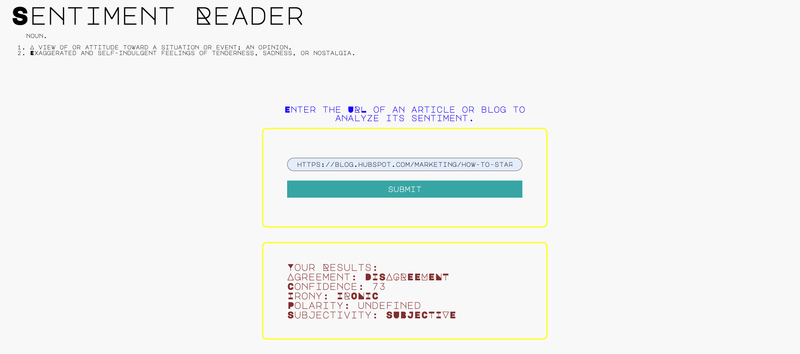

# Project #4: Sentiment Reader Using Nartural Language Processing (NLP)

## Table of Contents

- [ Project Summary ](#ProjectSummary)
- [ Project Goals ](#ProjectGoals)
- [ Tools Used](#ToolsUsed)
- [ References/Credit](#References/Credit)
- [ Result](#Result)

## Project Summary

We will create a tool that allows users to run Natural Language Processing (NLP) on various articles, blogs, or news-sources that they find across the web, using an API. The user will be able to discern informaiton about the URL source, such as: agreement, confidence, irony, polarity, and subjectivity.

## Project Goals

- Setting up Webpack
- Sass styles
- Webpack Loaders and Plugins
- Creating layouts and page design
- Service workers
- Using APIs and creating requests to external urls

> Natural language processing (NLP) is a subfield of computer science, information engineering, and artificial intelligence
> concerned with the interactions between computers and human (natural) languages, in particular how to program computers to
> process and analyze large amounts of natural language data.

### Running the App

- Development Mode: `npm run build-dev`
- Production Mode: `npm run build-prod`
- Nodemon: `nodemon src/server/index.js`
- Open `localhost: 8081` in the browser

## Tools Used

- HTML
- CSS
- JavaScript
- MeaningCloud API
- Express
- Sass
- Webpack
- Jest
- Nodemon
- Express
- BodyParser
- Cors

## References/Credit

- [https://www.freecodecamp.org/news/creating-a-production-ready-webpack-4-config-from-scratch/](https://www.freecodecamp.org/news/creating-a-production-ready-webpack-4-config-from-scratch/) (Creating webpack)
- [https://stackoverflow.com/questions/49001115/npm-run-build-error-for-html-webpack-plugin](https://stackoverflow.com/questions/49001115/npm-run-build-error-for-html-webpack-plugin) (npm run build error)
- [https://stackoverflow.com/questions/44845143/webpack-command-not-found](https://stackoverflow.com/questions/44845143/webpack-command-not-found) (webpack command not found)
- [https://stackoverflow.com/questions/42754388/uncaught-in-promise-typeerror-failed-to-fetch-and-cors-error](https://stackoverflow.com/questions/42754388/uncaught-in-promise-typeerror-failed-to-fetch-and-cors-error) (Failed to fetch and cors error)
- [https://exerror.com/getting-typeerror-failed-to-fetch-when-the-request-hasnt-actually-failed/](https://exerror.com/getting-typeerror-failed-to-fetch-when-the-request-hasnt-actually-failed/) (type error- failed to fetch)
- [https://stackoverflow.com/questions/49348482/npm-install-with-error-gyp-failed-with-exit-code-1](https://stackoverflow.com/questions/49348482/npm-install-with-error-gyp-failed-with-exit-code-1) (npm install error)
- [https://www.meaningcloud.com/](https://www.meaningcloud.com/)
- [https://webpack.js.org/concepts/](https://webpack.js.org/concepts/)
- [https://sass-lang.com/guide](https://sass-lang.com/guide)
- [https://stackoverflow.com/questions/18875674/whats-the-difference-between-dependencies-devdependencies-and-peerdependencies](https://stackoverflow.com/questions/18875674/whats-the-difference-between-dependencies-devdependencies-and-peerdependencies) (dependencies vs dev dependencies)
- [https://stackoverflow.com/questions/65382522/node-vm121-post-http-localhost3000-auth-neterr-connection-refused](https://stackoverflow.com/questions/65382522/node-vm121-post-http-localhost3000-auth-neterr-connection-refused) (Connection Refused)

## Result

<!-- [Image of Final Project](./demo.png) -->

